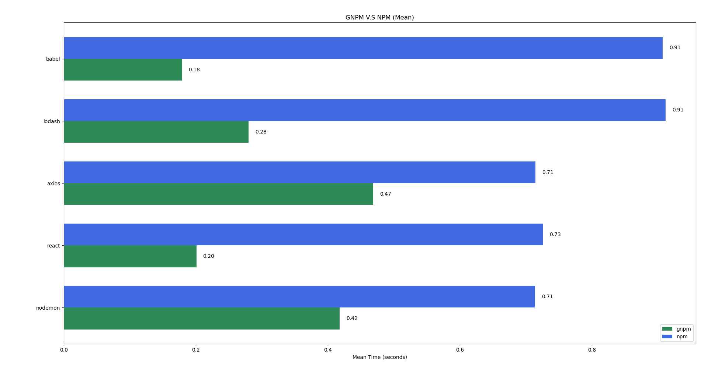

## GNPM

GNPM is a fast package manger for Node modules written in Go.
It aims to provide faster installs compared to npm by leveraging caching, parallelism, and optimized I/O.

## Benchmarks 
### Overall Comparison 

### Raw Command

These benchmarks were run using hyperfine, the results were stored in json files that were then used by a Python script to generate the above graph. 

Due to the variability of HTTP requests, benchmark results may differ across environments.

## Why is it Fast?
1. **In-memory caching**  
   - Resolved and downloaded packages are cached to minimize HTTP requests and file extraction overhead.  

2. **Package reuse**  
   - When a version constraint is given, GNPM reuses a previously downloaded version that satisfies the constraint.  

3. **Minimized registry requests**  
   - Avoids repeated HTTP requests when resolving package versions without a specific version.  

4. **Persistent HTTP connections**  
   - Keeps a single HTTP client alive to reuse across requests.
  
5. **Parallel operations**  
   - Uses multiple goroutines to resolve versions, download, and extract packages concurrently.  

6. **Optimized decompression**  
   - Uses [`github.com/klauspost/pgzip`](https://github.com/klauspost/pgzip) instead of the standard `compress/gzip` for faster decompression.

## Todo : 
- Read and write lockfiles  
- Implement global cache with symlinks  
